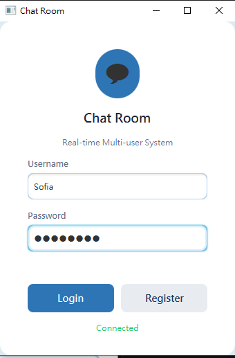
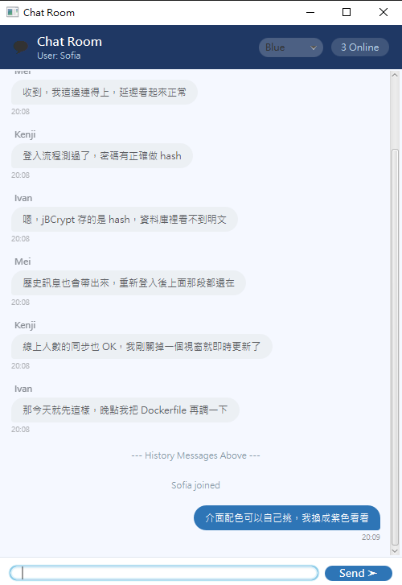
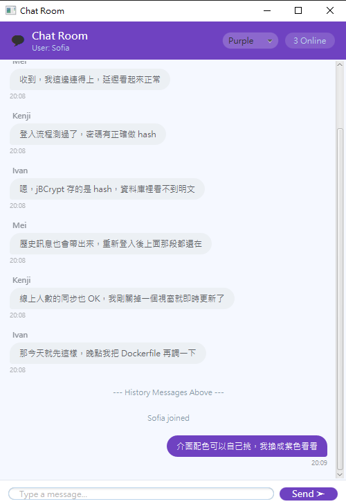

# JavaFX 多人即時聊天室

> Java Socket 多執行緒伺服器 + JavaFX 桌面客戶端。
> 支援帳號註冊／登入、即時群聊、歷史訊息回溯、線上人數同步與訊息音效，
> 伺服器以 Docker 部署於 Railway，客戶端從任何電腦連線。

**課程分組專案 ｜ 擔任組長：[IvanWu0911](https://github.com/IvanWu0911)**

Java 17 · JavaFX 21 · Socket · PostgreSQL

| 登入／註冊 | 聊天室 |
|---|---|
|  |  |

訊息氣泡依發送者左右分流，標頭顯示目前線上人數與主題配色選單；
登入後會先載入歷史訊息，並以 `--- History Messages Above ---` 與新訊息分隔。

**主題配色即時切換** —— 同一個畫面切換配色，標頭、送出鈕與自己的訊息氣泡會一併更新：

| Blue（預設） | Purple |
|---|---|
|  |  |

---

## 架構

```
JavaFX Client  ──TCP Socket (JSON)──>  ChatServer  ──JDBC──>  PostgreSQL
  (本機執行)                           (Railway 容器)          (Railway)
```

- **Server**：`ServerSocket` 接受連線，每個客戶端一條執行緒，
  以 `ConcurrentHashMap<String, Handler>` 維護線上名單並廣播訊息
- **Client**：JavaFX + FXML，登入後開啟聊天視窗，背景執行緒持續讀取伺服器推播
- **協定**：以 Gson 序列化的單行 JSON，型別由 `MessagePacket.Type` 定義
  （`LOGIN` / `REGISTER` / `AUTH_OK` / `AUTH_FAIL` / `CHAT` / `SYSTEM` / `HISTORY` / `ONLINE`）

`MessagePacket` 使用 Java 17 `record` 定義為不可變訊息物件，
伺服器廣播前以 `withOnlineCount()` 產生帶人數的副本，避免共用可變狀態。

## 功能

- **帳號系統**：註冊與登入，密碼以 jBCrypt 雜湊後存入資料庫，不保留明文
- **即時群聊**：訊息廣播給所有線上使用者，自己與他人的訊息以不同氣泡樣式呈現
- **歷史訊息**：登入後自動載入先前的對話紀錄
- **線上人數**：連線／離線即時同步顯示
- **介面主題**：五種配色（Blue／Green／Red／Black／Purple）即時切換，已顯示的訊息氣泡也會一起重新上色
- **音效回饋**：傳送、接收、加入、離開、錯誤各有提示音

## 技術棧

| 項目 | 技術 |
|---|---|
| 語言 | Java 17（`var`、`record`、switch expressions） |
| GUI | JavaFX 21 + FXML + CSS |
| 網路 | `java.net.Socket` / `ServerSocket`、多執行緒 |
| 序列化 | Gson |
| 資料庫 | PostgreSQL（JDBC） |
| 安全 | jBCrypt 密碼雜湊 |
| 建置 | Maven |
| 部署 | Docker（multi-stage build）→ Railway |

## 專案結構

```
src/main/java/chat/
├── server/ChatServer.java        # Socket 伺服器與廣播邏輯
├── client/
│   ├── AppLauncher.java          # JavaFX 進入點
│   ├── ChatClient.java           # 連線管理與訊息收發
│   ├── LoginController.java      # 登入／註冊畫面
│   └── ChatController.java       # 聊天畫面、氣泡渲染、主題切換
├── db/DatabaseManager.java       # JDBC 連線、建表、帳號驗證、訊息存取
├── model/MessagePacket.java      # 通訊協定（record）
└── sound/SoundManager.java       # 音效播放
```

## 執行

### 1. 資料庫

需要一個 PostgreSQL；`DatabaseManager` 啟動時會自動建立 `users` 與 `messages` 資料表。

### 2. 伺服器

```bash
mvn clean package -DskipTests
java -jar target/ChatServer.jar
```

伺服器讀取的環境變數：

| 變數 | 預設值 | 說明 |
|---|---|---|
| `DB_URL` | `jdbc:postgresql://localhost:5432/chatroom` | 資料庫連線字串 |
| `DB_USER` | `postgres` | 資料庫帳號 |
| `DB_PASS` | `password` | 資料庫密碼 |
| `PORT` | `12345` | 監聽埠 |

以 Docker 執行（`Dockerfile` 為 multi-stage，建置與執行環境分離）：

```bash
docker build -t chatserver .
docker run -p 12345:12345 -e DB_URL=... -e DB_USER=... -e DB_PASS=... chatserver
```

### 3. 客戶端

```bash
mvn javafx:run
```

或指定伺服器位址：

```bash
java -jar target/ChatClient.jar <host> <port>
```

亦可用環境變數 `SERVER_HOST` / `SERVER_PORT` 指定，預設連線 `localhost:12345`。

## 授權

Private — All rights reserved.
